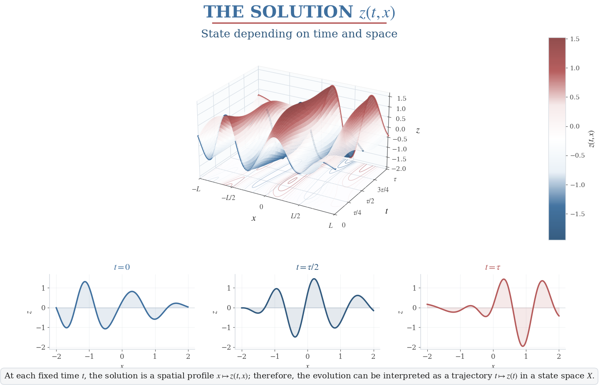
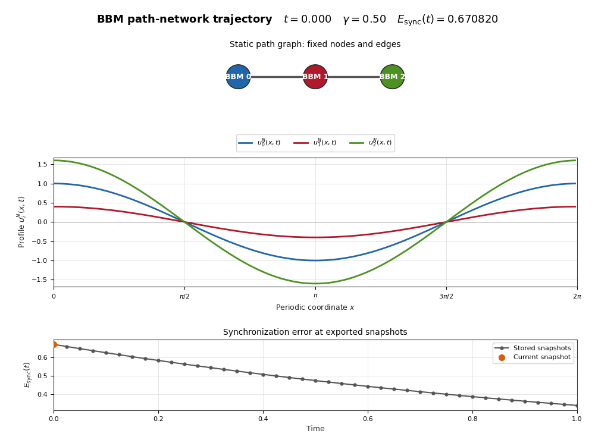
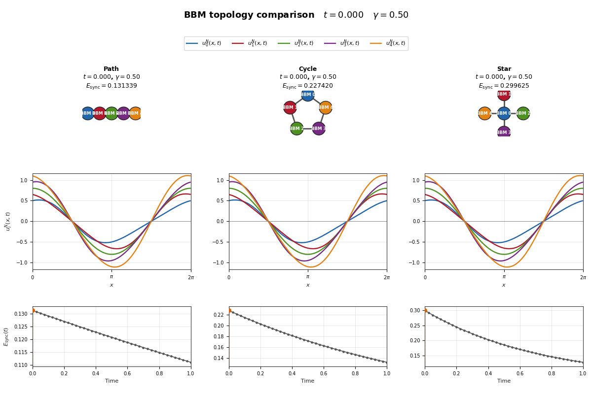
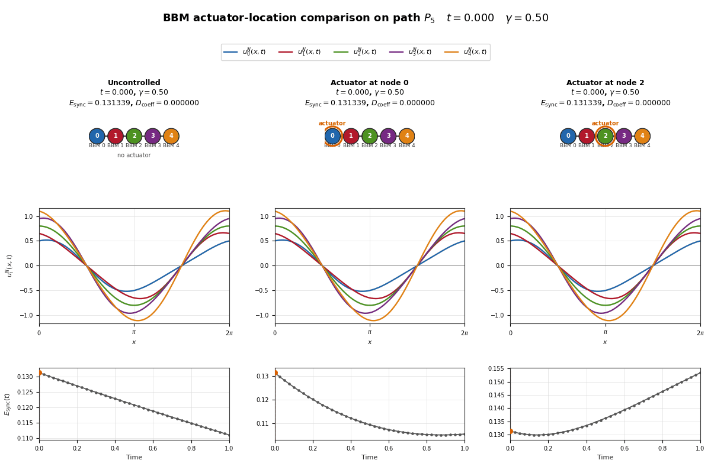

# Análisis de redes BBM mediante Ciencia de Datos

**Proyecto académico — Análisis de Bases de Datos**
**Maestría en Ciencia de Datos — Universidad Yachay Tech**

**Autor:** Héctor Alexander Román Potosí

---

## Descripción del proyecto

Este proyecto estudia el comportamiento de redes de sistemas Benjamin–Bona–Mahony (BBM) mediante técnicas de análisis de datos y aprendizaje automático.

La idea principal es utilizar un modelo matemático como generador de datos sintéticos. Cada simulación corresponde a una configuración específica de red, acoplamiento, condición inicial y estrategia de actuación.

A partir de estas simulaciones se construyó un dataset estructurado de:

$$
\boxed{1200\text{ experimentos}}
$$

que posteriormente se utiliza para:

- análisis exploratorio de datos;
- comparación de escenarios controlados y no controlados;
- estudio de interacciones entre variables;
- visualización de patrones;
- regresión lineal;
- Random Forest;
- validación agrupada para evitar fuga de información.

La cadena conceptual del proyecto es:

$$
\boxed{
\text{modelo BBM}
\rightarrow
\text{red}
\rightarrow
\text{simulaciones}
\rightarrow
\text{dataset}
\rightarrow
\text{EDA}
\rightarrow
\text{Machine Learning}
}
$$

Los datos utilizados son sintéticos y se generan completamente mediante simulación numérica.

---

## Pregunta de análisis

La pregunta principal del proyecto es:

> **¿Cómo influyen la topología de la red, el acoplamiento, las condiciones iniciales y la ubicación de los actuadores en la dinámica y en las métricas de sincronización de una red de sistemas BBM?**

El objetivo no es analizar una única trayectoria, sino estudiar una población de experimentos computacionales y buscar patrones entre configuraciones distintas.

---

## ¿Por qué este proyecto pertenece a Ciencia de Datos?

La ecuación BBM proporciona el mecanismo matemático que genera las observaciones.

La parte de Ciencia de Datos comienza cuando esas simulaciones se organizan como un conjunto estructurado de datos y se estudian de forma sistemática.

En lugar de observar solamente una trayectoria:

$$
u(x,t)
$$

se analizan cientos de configuraciones con diferentes características experimentales.

El flujo general es:

$$
\text{modelo matemático}
\rightarrow
\text{diseño experimental}
\rightarrow
\text{simulación}
\rightarrow
\text{dataset}
\rightarrow
\text{análisis}
\rightarrow
\text{predicción}
$$

Cada fila del dataset representa una simulación completa.

---

## Estructura general del trabajo

El proyecto se divide en cuatro etapas principales:

1. **Modelado matemático:** definición de la dinámica BBM y del acoplamiento mediante grafos.
2. **Generación de datos:** ejecución reproducible de múltiples simulaciones.
3. **Análisis exploratorio:** estudio de patrones, interacciones y efectos de los actuadores.
4. **Modelado predictivo:** comparación entre modelos supervisados y evaluación de su capacidad de generalización.

---

# Fundamentos matemáticos


## 1. Estado de un sistema BBM

Cada nodo de la red representa un sistema Benjamin–Bona–Mahony (BBM).

Su estado se escribe como

$$
u_i(x,t),
$$

donde:

- $i$ identifica el nodo de la red;
- $x$ representa la posición espacial;
- $t$ representa el tiempo.

Para un instante fijo $t=t_0$,

$$
u_i(x,t_0)
$$

representa un perfil espacial completo.

Por tanto, el estado de un nodo no es simplemente un número. Es una función espacial que evoluciona con el tiempo.

Si además fijamos una posición $x=x_0$, entonces

$$
u_i(x_0,t)
$$

sí puede interpretarse como una señal escalar que cambia con el tiempo.

Esta distinción será importante cuando utilicemos Fourier para representar numéricamente cada estado BBM.

La siguiente figura ilustra cómo una solución $u(x,t)$ puede interpretarse simultáneamente como una superficie espacio--tiempo y como una familia de perfiles espaciales obtenidos al fijar distintos instantes.

<p align="center">
  
</p>

*Figura de contexto matemático: representación espacio--temporal de una solución BBM.*


---

## 2. Ecuación BBM en un nodo

Una forma esquemática de la dinámica utilizada para el nodo $i$ es

$$
(1-\partial_{xx})u_{i,t}
+
u_{i,x}
+
u_i u_{i,x}
=
\gamma
\sum_j w_{ij}(u_j-u_i)
+
\mathrm{control}_i.
$$

En esta expresión:

- $u_i(x,t)$ es el estado del nodo $i$;
- $u_{i,t}$ representa la evolución temporal;
- $u_{i,x}$ representa la variación espacial;
- $u_i u_{i,x}$ introduce la no linealidad;
- $\gamma$ controla la intensidad del acoplamiento;
- $w_{ij}$ describe las conexiones de la red;
- $\mathrm{control}_i$ representa una intervención externa.

La ecuación combina tres elementos:

$$
\boxed{
\text{dinámica BBM}
+
\text{interacción con la red}
+
\text{control}
}
$$

---

## 3. De un sistema BBM a una red

En lugar de estudiar una única función

$$
u(x,t),
$$

se consideran varios sistemas:

$$
u_0(x,t),
\quad
u_1(x,t),
\quad
\dots,
\quad
u_{n-1}(x,t).
$$

Cada función corresponde a un nodo del grafo.

Por ejemplo, una red tipo path con tres nodos es

```text
0 --- 1 --- 2
```

y representa tres sistemas BBM conectados:

```text
BBM_0 --- BBM_1 --- BBM_2
```

Las aristas indican qué sistemas pueden interactuar directamente.

En este ejemplo:

- el nodo 0 interactúa con el nodo 1;
- el nodo 1 interactúa con los nodos 0 y 2;
- el nodo 2 interactúa con el nodo 1.

La teoría de grafos permite representar esta estructura de interacción de forma matricial.

---

## 4. Matriz de adyacencia

La estructura del grafo puede representarse mediante una matriz de adyacencia $A$.

Para el grafo

```text
0 --- 1 --- 2
```

se tiene

$$
A=
\begin{pmatrix}
0 & 1 & 0\\
1 & 0 & 1\\
0 & 1 & 0
\end{pmatrix}.
$$

El elemento $a_{ij}$ indica si dos nodos están conectados.

En un grafo no dirigido y sin pesos,

$$
a_{ij}=
\begin{cases}
1, & \text{si } i \text{ y } j \text{ están conectados},\\
0, & \text{en otro caso.}
\end{cases}
$$

---

## 5. Matriz de grados

El grado de un nodo es el número de conexiones que posee.

Para el mismo grafo,


$$
d_0=1,
\quad
d_1=2,
\quad
d_2=1.
$$

La matriz de grados es diagonal:

$$
D=
\begin{pmatrix}
1 & 0 & 0\\
0 & 2 & 0\\
0 & 0 & 1
\end{pmatrix}.
$$

En general,

$$
d_i=\sum_j a_{ij}.
$$

Por tanto, la diagonal de $D$ contiene exactamente el número de vecinos de cada nodo.

---

## 6. Laplaciano del grafo

El Laplaciano se define como

$$
\boxed{L=D-A}.
$$

Para el ejemplo anterior,

$$
L=
\begin{pmatrix}
1 & -1 & 0\\
-1 & 2 & -1\\
0 & -1 & 1
\end{pmatrix}.
$$

La diagonal de $L$ contiene los grados de los nodos.

Fuera de la diagonal:

- aparece $-1$ si existe una arista entre dos nodos;
- aparece $0$ si no existe conexión directa.

Cada fila del Laplaciano suma cero.

Por tanto,

$$
L\mathbf{1}=0.
$$

Si todos los nodos tienen el mismo estado, el Laplaciano no detecta diferencias entre ellos.

---

## 7. Interpretación del Laplaciano

Sea

$$
U=
\begin{pmatrix}
u_0\\
u_1\\
u_2
\end{pmatrix}.
$$

Entonces,

$$
LU=
\begin{pmatrix}
u_0-u_1\\
-u_0+2u_1-u_2\\
u_2-u_1
\end{pmatrix}.
$$

El Laplaciano compara el estado de cada nodo con los estados de sus vecinos.

Como el acoplamiento utiliza la forma

$$
\sum_j w_{ij}(u_j-u_i),
$$

este término equivale, con la convención utilizada, a

$$
-(LU)_i.
$$

Por tanto, el acoplamiento global puede escribirse como

$$
\boxed{-\gamma LU}.
$$

Esta expresión resume en una única operación matricial todas las diferencias entre nodos conectados.

---

## 8. Interpretación espectral

Los autovalores y autovectores del Laplaciano satisfacen

$$
Lv=\lambda v.
$$

Los autovectores pueden interpretarse como patrones de variación sobre la red, mientras que los autovalores indican qué tan intensamente el Laplaciano detecta esos patrones.

El autovalor

$$
\lambda_1=0
$$

está asociado al modo constante, es decir, al caso en que todos los nodos tienen el mismo estado.

El segundo autovalor,

$$
\lambda_2,
$$

se conoce como conectividad algebraica.

Para un grafo conectado,

$$
\lambda_2>0.
$$

Esta cantidad contiene información sobre la conectividad global de la red.

---

## 9. Aproximación espectral de Fourier

Cada estado BBM se aproxima mediante una expansión de Fourier:

$$
u_i^K(x,t)
=
\sum_{k=-K}^{K}
a_{i,k}(t)e^{ikx}.
$$

La función espacial $u_i(x,t)$ queda representada por un conjunto finito de coeficientes

$$
a_{i,k}(t).
$$

Con esta aproximación, el problema continuo se transforma en un sistema finito de ecuaciones diferenciales ordinarias para los coeficientes de Fourier.

En los experimentos principales se utiliza:

$$
K=4,
\quad
T=1,
\quad
h=0.0025.
$$


---

## 10. Integración temporal

La evolución temporal de los coeficientes de Fourier se calcula mediante Runge–Kutta clásico de cuarto orden.

El flujo numérico puede resumirse como

$$
u_i(x,0)
\rightarrow
a_{i,k}(0)
\rightarrow
\text{RK4}
\rightarrow
a_{i,k}(t)
\rightarrow
u_i(x,t).
$$

Cada paso temporal produce un nuevo estado de la red y permite reconstruir las trayectorias de los sistemas BBM.


---

## 11. Del modelo matemático al dataset

La cadena completa de generación de datos es

$$
\boxed{
\text{ecuaciones BBM}
\rightarrow
\text{grafo}
\rightarrow
\text{Fourier}
\rightarrow
\text{RK4}
\rightarrow
\text{simulación}
\rightarrow
\text{variables}
\rightarrow
\text{dataset}
}
$$

Cada configuración experimental produce una simulación completa.

A `artir de esa simulación se extraen variables relacionadas con:

- topología;
- tamaño de red;
- acoplamiento;
- condición inicial;
- estrategia del actuador;
- error de sincronización;
- esfuerzo de control;
- normas de coeficientes;
- diferencias respecto del escenario no controlado.

Por tanto, el modelo matemático funciona como mecanismo generador de datos sintéticos que luego se analizan desde Ciencia de Datos.

---

# Diseño experimental

El dataset principal se construye a partir de un diseño factorial que combina varios factores experimentales.

La combinación es

$$
3\times5\times4\times5\times4
=
1200.
$$

Por tanto, se generan

$$
\boxed{1200\text{ simulaciones}}.
$$

Cada simulación corresponde a una configuración única de los siguientes factores:

| Factor | Valores |
|---|---|
| Topología | path, cycle, star |
| Número de nodos | 4, 5, 6, 7, 8 |
| Acoplamiento $\gamma$ | 0, 0.25, 0.5, 1 |
| Condición inicial | 5 configuraciones |
| Escenario de actuación | 4 estrategias |

---

## Topologías

Se estudian tres familias de grafos:

- **Path:** los nodos se conectan formando una cadena.
- **Cycle:** los nodos forman un ciclo cerrado.
- **Star:** un nodo central o hub se conecta con todos los demás.

Estas topologías permiten evaluar cómo la estructura de la red modifica la dinámica de los sistemas BBM.

---

## Tamaño de red

Se consideran redes con

$$
n=4,5,6,7,8.
$$

Esto permite estudiar si el efecto de los actuadores y el acoplamiento dependen del tamaño de la red.

---

## Acoplamiento de la red

El parámetro

$$
\gamma
$$

controla la intensidad de interacción entre nodos conectados.

En el experimento se utilizan los valores

$$
\gamma \in \{0,\;0.25,\;0.5,\;1\}.
$$

Cuando

$$
\gamma=0,
$$

el acoplamiento del grafo no influye en la dinámica.

Al aumentar $\gamma$, la interacción entre los nodos se hace más intensa.

---

## Condiciones iniciales

Cada experimento se ejecuta bajo una de cinco configuraciones iniciales.

La condición inicial es importante porque determina el estado de partida de cada red BBM.

El análisis exploratorio mostrará posteriormente que la respuesta a un mismo actuador puede cambiar según la condición inicial.

---

## Escenarios de actuación

Se consideran cuatro escenarios:

```text
uncontrolled
single_0
single_middle
two_0_last
```

Su interpretación es:

- `uncontrolled`: no se aplica actuador;
- `single_0`: se actúa sobre el nodo 0;
- `single_middle`: se actúa sobre un nodo central;
- `two_0_last`: se utilizan dos actuadores, en los extremos de la red.

---

## Una fila del dataset

Cada fila del dataset representa una simulación completa.

En consecuencia, una observación no representa un nodo aislado ni un único instante de tiempo, sino el resumen de un experimento completo.

Esto es importante para interpretar correctamente las variables del dataset.

---

# Métrica de sincronización

Para comparar el comportamiento de los nodos de una red se utiliza una métrica de error de sincronización.

De forma conceptual, esta métrica mide qué tan diferentes son los estados de los nodos en un instante dado.

Cuando el error es pequeño, los nodos se encuentran más cerca de un comportamiento similar.

En cambio, un valor mayor indica mayor diferencia entre los estados de la red.

---

## Comparación respecto del escenario sin control

Para cuantificar el efecto de una estrategia de actuación, se utiliza la diferencia

$$
\Delta E_{\text{sync}}
=
E_{\text{sync}}^{\text{controlado}}(T)
-
E_{\text{sync}}^{\text{sin control}}(T).
$$

Por tanto:

- si $\Delta E_{\text{sync}}<0$, la estrategia controlada termina con un error de sincronización menor que el escenario sin control;
- si $\Delta E_{\text{sync}}=0$, no hay diferencia final respecto del baseline;
- si $\Delta E_{\text{sync}}>0$, el error final es mayor que en el escenario sin control.

Esta convención es fundamental para interpretar las figuras, tablas y modelos predictivos del proyecto.

---

## Interpretación correcta de $\Delta E_{\text{sync}}$

Un valor negativo no debe interpretarse como una demostración de controlabilidad.

Significa únicamente que, para esa configuración experimental concreta, el error final de sincronización fue menor con la estrategia de actuación empleada.

De forma análoga, un valor positivo no implica que el actuador sea inútil de forma general, sino que en esa simulación concreta el error final fue mayor que en el baseline.

---

# Visualización dinámica de las simulaciones

Las trayectorias completas contienen mucha más información que una única métrica final. Por esta razón, además del dataset tabular, el proyecto incluye animaciones construidas a partir de los estados simulados de la red.

Estas visualizaciones no sustituyen al análisis cuantitativo. Su función es complementar las métricas y permitir observar cómo evoluciona espacial y temporalmente cada sistema BBM.

---

## 1. Evolución de una red tipo path

<p align="center">
  
</p>

*Animación de una red BBM tipo path reconstruida a partir de los estados obtenidos durante la simulación.*

Esta animación muestra la evolución temporal de los perfiles espaciales asociados a los nodos de una red tipo path.

Para cada instante $t$, cada curva representa un estado

$$
u_i(x,t).
$$

Al avanzar el tiempo pueden observarse:

- cambios en la forma de los perfiles;
- propagación de diferencias entre nodos conectados;
- aproximación o separación entre las trayectorias;
- efecto acumulado del acoplamiento de la red.

La animación se obtiene a partir de los estados numéricos generados durante la integración temporal y de la reconstrucción de Fourier. Por tanto, los cuadros representan estados calculados por la simulación y no una interpolación visual artificial.

Esta figura permite conectar directamente la ecuación BBM con los datos que posteriormente se resumen en el dataset.

---

## 2. Comparación entre topologías

<p align="center">
  
</p>

*Comparación dinámica entre redes path, cycle y star bajo una configuración experimental común.*

Aquí se comparan las tres topologías principales del estudio:

```text
path
cycle
star
```

La condición inicial, el horizonte temporal y los demás parámetros del experimento se mantienen comparables para aislar visualmente el efecto de la estructura de la red.

La topología modifica la matriz de adyacencia $A$, la matriz de grados $D$ y, en consecuencia, el Laplaciano

$$
L=D-A.
$$

Por ello, aunque los nodos individuales sigan la misma dinámica BBM, el patrón de interacción entre ellos cambia.

La animación sirve como evidencia visual de que la estructura del grafo puede modificar la evolución colectiva. Sin embargo, no debe interpretarse como una demostración de que una topología sea universalmente superior a otra: la respuesta también depende del tamaño de la red, del acoplamiento y de las condiciones iniciales.

---

## 3. Comparación de estrategias de actuación

<p align="center">
  
</p>

*Comparación de la dinámica de una misma red bajo distintas ubicaciones de actuadores.*

Esta animación compara escenarios de actuación manteniendo fija la estructura principal del experimento.

El objetivo visual es responder una pregunta sencilla:

> ¿Cambiar la ubicación del actuador modifica la respuesta de la red?

La comparación permite observar que dos estrategias con un esfuerzo de control comparable pueden producir trayectorias diferentes.

Esto motiva una de las variables centrales del dataset:

```text
scenario
```

y justifica estudiar de manera sistemática las estrategias

```text
uncontrolled
single_0
single_middle
two_0_last
```

La animación no demuestra por sí sola cuál estrategia es óptima. Su función es mostrar por qué la ubicación de los actuadores constituye un factor experimental relevante que posteriormente se analiza con estadística descriptiva y modelos supervisados.

---

## De las animaciones a las variables

Las animaciones muestran trayectorias completas, mientras que el dataset necesita representaciones tabulares que puedan compararse entre cientos de experimentos.

Por ello, cada simulación se resume mediante variables numéricas como el error de sincronización final, diferencias respecto del escenario sin control, esfuerzo de actuación y otras características derivadas.

El flujo conceptual es

$$
\boxed{
\text{trayectoria dinámica}
\rightarrow
\text{métricas}
\rightarrow
\text{fila del dataset}
}
$$

Esta transformación permite pasar de la observación cualitativa de una trayectoria a un análisis reproducible sobre las $1200$ simulaciones.

---
